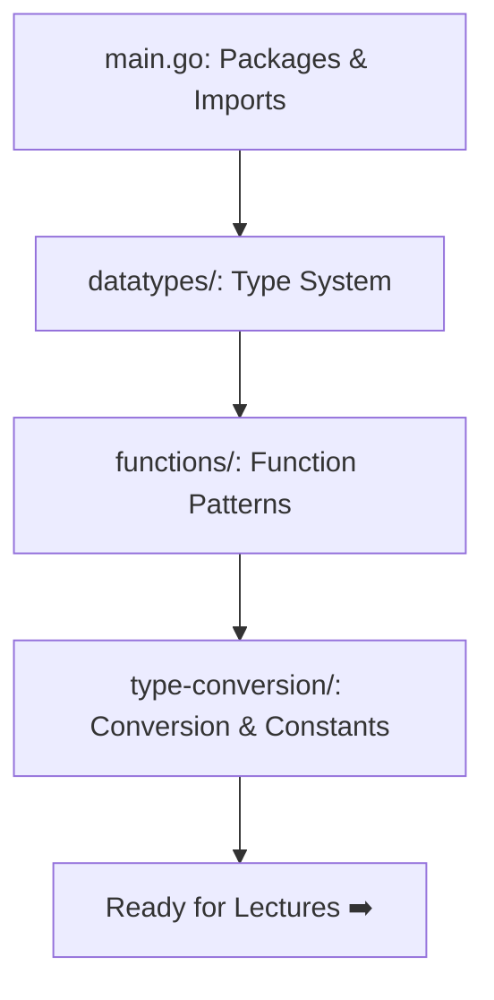

# 📦 LastGoBasics — Go Fundamentals from Official Tour

## 🧠 Overview

This module covers Go fundamentals following the [official Go Tour](https://go.dev/tour), focusing on **packages**, **imports**, **exported names**, and core Go patterns.

### Project Structure

```
LastGoBasics/
├── main.go          # Entry point — packages, imports, exported names
├── datatypes/       # Go's type system in depth
│   └── main.go
├── functions/       # Functions, multiple returns, named returns
│   └── main.go
├── type-conversion/ # Explicit conversion and constants
│   └── main.go
├── go.mod           # Module definition
└── README.md        # This file
```

## 🔁 Learning Flow



## 💡 Key Concepts from `main.go`

### Packages
- Every Go file starts with `package` declaration
- Package names should be **short** and **lowercase**
- `package main` → executable program
- Other packages → reusable libraries

### Imports
```go
import (
    "fmt"        // Standard library
    "math"       // Standard library
    "math/rand"  // Sub-package
)
```
- Use **grouped import** (parentheses) — idiomatic Go
- Unused imports = **compile error**

### Exported Names
In Go, a name is **exported** if it begins with a **capital letter**:
```go
math.Pi   // ✅ Exported — accessible
math.pi   // ❌ Unexported — not accessible outside package
```

### UTF-8 Support
Go source code is **UTF-8 encoded** and supports 120k+ Unicode characters:
```go
fmt.Println("こんにちは")  // Japanese
fmt.Println("🚀 Go!")     // Emoji
```

## 📝 Advanced Topics to Explore Next
- Interfaces
- Channels
- Concurrency (goroutines)
- Generics (Go 1.18+)

## 🔗 Reference Links
- [Go Tour — Welcome](https://go.dev/tour/welcome/1)
- [Go Tour — Packages](https://go.dev/tour/basics/1)
- [Go Tour — Exported Names](https://go.dev/tour/basics/3)
- [Effective Go](https://go.dev/doc/effective_go)
