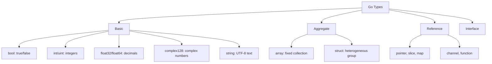

# 📦 Data Types in Go

## 🧠 Concept Overview

Go is a **statically-typed** language with a rich type system. Types are divided into four categories: **Basic**, **Aggregate**, **Reference**, and **Interface** types.

### Type Categories

| Category | Types | Description |
|---|---|---|
| **Basic** | `bool`, `int`, `float64`, `string`, `complex128` | Primitive types |
| **Aggregate** | `array`, `struct` | Composite types |
| **Reference** | `pointer`, `slice`, `map`, `channel`, `function` | Reference semantics |
| **Interface** | `interface` | Behavioral contracts |

## 🔁 Type Hierarchy



## 💡 Deep Dive

### Integer Types

| Type | Size | Range |
|---|---|---|
| `int8` | 8 bits | -128 to 127 |
| `int16` | 16 bits | -32,768 to 32,767 |
| `int32` | 32 bits | -2.1B to 2.1B |
| `int64` | 64 bits | -9.2×10¹⁸ to 9.2×10¹⁸ |
| `uint8` | 8 bits | 0 to 255 |
| `uint64` | 64 bits | 0 to 18.4×10¹⁸ |
| `int` | Platform | 32 or 64 bit (system architecture) |

### Bit Shifting for Max Values
```go
MaxInt uint64 = 1<<64 - 1  // Shift 1 left by 64 bits, subtract 1
// Result: 18446744073709551615
```
This is a common pattern to get the maximum value of an unsigned integer.

### Complex Numbers
```go
z := cmplx.Sqrt(-5 + 12i)
// Go has built-in support for complex numbers!
// complex64  → float32 real + float32 imaginary
// complex128 → float64 real + float64 imaginary
```

### Format Verbs for Types
```go
fmt.Printf("Type: %T Value: %v\n", ToBe, ToBe)     // Type + value
fmt.Printf("Type: %T Value: %q\n", str, str)        // %q → quoted string
```

| Verb | Purpose |
|---|---|
| `%T` | Print the type |
| `%v` | Print the value (default format) |
| `%q` | Print string with double quotes |
| `%s` | Print raw string |
| `%d` | Print integer |
| `%f` | Print float |
| `%b` | Print binary |
| `%x` | Print hexadecimal |

### Float Types — No System Default
Unlike `int` (which adapts to system architecture), floating-point types **must be explicit**:
```go
var f1 float32  // 32-bit IEEE 754
var f2 float64  // 64-bit IEEE 754 (recommended default)
```

### Zero Values
Every type has a default **zero value**:
```go
var b bool       // false
var i int        // 0
var f float64    // 0.0
var s string     // ""
var p *int       // nil
```

## 🔗 Reference Links
- [Go Tour — Basic Types](https://go.dev/tour/basics/11)
- [Go Tour — Zero Values](https://go.dev/tour/basics/12)
- [Go Spec — Types](https://go.dev/ref/spec#Types)
- [Go Blog — Strings, bytes, runes](https://go.dev/blog/strings)
