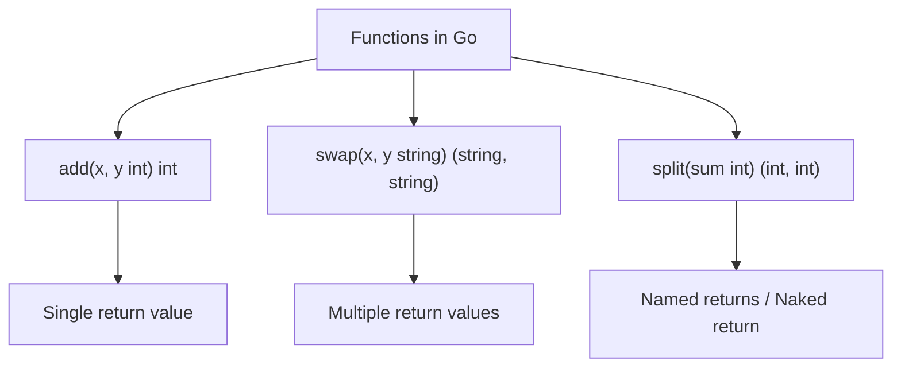

# 📦 Functions in Go (Tour-Style)

## 🧠 Concept Overview

This module covers Go functions following the [official Go Tour](https://go.dev/tour/basics/4), including **multiple return values**, **named returns**, **naked returns**, and **package-level variables**.

### Key Concepts

| Concept | Description |
|---|---|
| `func name(params) returnType` | Basic function declaration |
| `func name(x, y int) int` | Shortened params (same type) |
| `func name() (string, string)` | Multiple return values |
| `func name(sum int) (x, y int)` | Named return values |
| `return` (naked) | Returns named values implicitly |

## 🔁 Function Patterns Flow



## 💡 Deep Dive

### Shortened Parameter Syntax
When consecutive parameters share a type, you can omit all but the last type:
```go
func add(x int, y int) int  →  func add(x, y int) int
```

### Multiple Return Values
```go
func swap(x, y string) (string, string) {
    return y, x
}

a, b := swap("hello", "world")
// a = "world", b = "hello"
```
This is fundamental to Go's **error handling pattern**:
```go
result, err := someFunction()
```

### Named Return Values (Naked Return)
```go
func split(sum int) (x, y int) {  // x, y are pre-declared
    x = sum * 4 / 9
    y = sum - x
    return  // naked return — returns x and y automatically
}
```
> ⚠️ Named returns improve readability for short functions but can be confusing in longer functions. Use sparingly.

### Package-Level Variables
```go
var i, j int = 1, 2  // Accessible to all functions in the package

func main() {
    var c, python, java = true, false, "no!"  // Type inference
    fmt.Println(i, j, c, python, java)
}
```

### Variable Declaration Rules

| Context | `var x int` | `x := value` | Explanation |
|---|---|---|---|
| Package level | ✅ | ❌ | `:=` not allowed outside functions |
| Function level | ✅ | ✅ | Both work inside functions |
| Multiple vars | `var a, b = 1, 2` | `a, b := 1, 2` | Both support multiple |

### `var` Block Syntax
```go
var (
    name   string = "Amit"
    age    int    = 22
    active bool   = true
)
```
Groups related variable declarations for cleaner code.

## 🔗 Reference Links
- [Go Tour — Functions](https://go.dev/tour/basics/4)
- [Go Tour — Multiple Results](https://go.dev/tour/basics/6)
- [Go Tour — Named Return Values](https://go.dev/tour/basics/7)
- [Go Tour — Variables](https://go.dev/tour/basics/8)
- [Go by Example — Functions](https://gobyexample.com/functions)
- [Go by Example — Multiple Return Values](https://gobyexample.com/multiple-return-values)
