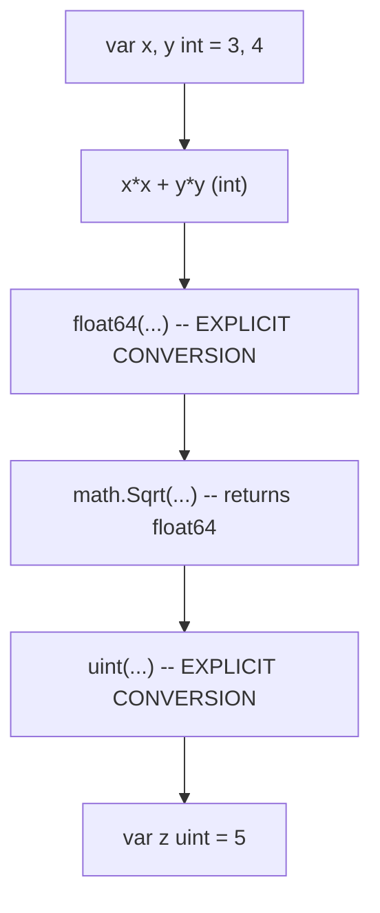

# 📦 Type Conversion & Constants in Go

## 🧠 Concept Overview

Go requires **explicit conversion** when assigning values between different types. It also features a powerful **type inference** system and **high-precision constants**.

### Key Concepts

| Concept | Description |
|---|---|
| `T(v)` | Explicitly converts value `v` to type `T` |
| Type Inference | Variable type is determined by the value it's initialized with |
| Constants | Values that cannot be changed after declaration |
| Numeric Constants | High-precision values that are untyped until used in context |

## 🔁 Type Conversion Flow



## 💡 Deep Dive

### Explicit Type Conversion
Go does **not** perform implicit conversion. Mixing types in expressions or assignments results in a compile error.
```go
var i int = 42
var f float64 = float64(i)
var u uint = uint(f)
```

### Type Inference
When declaring a variable without an explicit type (using `:=` or `var =`), Go infers the type based on the right-hand value.
- Integers → `int`
- Floats → `float64`
- Complex → `complex128`

### Constants
Declared with the `const` keyword. They can be character, string, boolean, or numeric values.
- **Cannot** use `:=` syntax.
- Evaluated at **compile time**.
- Have very high precision.

### Numeric Constants
Numeric constants are **untyped values**. An untyped constant takes the type needed by its context.
```go
const Big = 1 << 100
// Big is too large for an int, but fits in a float
fmt.Println(needFloat(Big)) // Works!
```

## 🔗 Reference Links
- [Go Tour – Type Conversions](https://go.dev/tour/basics/13)
- [Go Tour – Type Inference](https://go.dev/tour/basics/14)
- [Go Tour – Constants](https://go.dev/tour/basics/15)
- [Go Tour – Numeric Constants](https://go.dev/tour/basics/16)
