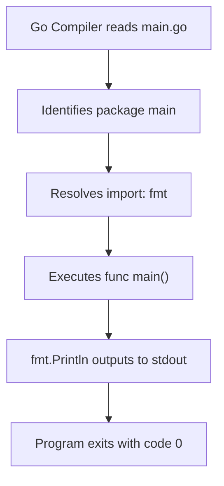

# 📦 Lecture 01 — Hello World in Go

## 🧠 Concept Overview

Every Go program starts with a **package declaration** and a **`main` function**. The `main` package is special — it tells the Go compiler that this is an **executable program** (not a library). The `main()` function is the **entry point** of execution.

### Key Concepts

| Concept | Description |
|---|---|
| `package main` | Declares the file as part of the executable package |
| `import "fmt"` | Imports the **fmt** (format) package for formatted I/O |
| `fmt.Println()` | Prints a line to standard output with a newline |
| Entry Point | Go always begins execution from `func main()` in `package main` |

## 🔁 Execution Flow

## 💡 Deep Dive

### Why `package main`?
Go distinguishes between **executable programs** and **reusable libraries**:
- `package main` → compiles to an **executable binary**
- Any other package name → compiles to a **library** that can be imported

### The `fmt` Package
The `fmt` package implements formatted I/O with functions analogous to C's `printf` and `scanf`:
- `Println` — prints with a newline
- `Printf` — formatted print (uses verbs like `%s`, `%d`, `%T`)
- `Sprintf` — returns formatted string instead of printing

### Go's Compilation Model
Go compiles to a **single static binary** — no runtime dependencies needed. This makes Go ideal for:
- Containerized applications (small Docker images)
- Cross-platform CLI tools
- Microservices

## 🔗 Reference Links
- [Go Tour – Hello World](https://go.dev/tour/welcome/1)
- [fmt Package Documentation](https://pkg.go.dev/fmt)
- [How to Write Go Code](https://go.dev/doc/code)
- [Effective Go](https://go.dev/doc/effective_go)
