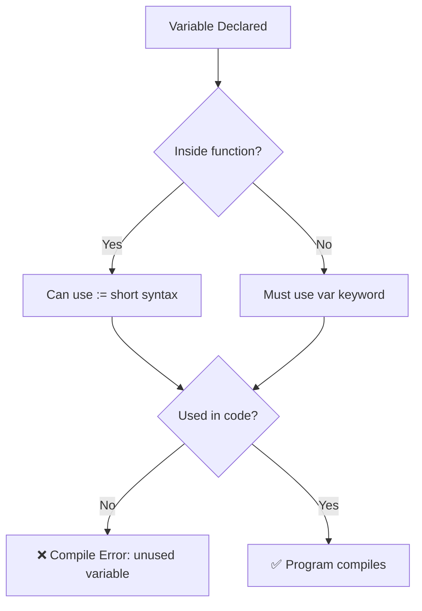

# 📦 Lecture 02 — Variables & Constants in Go

## 🧠 Concept Overview

Go is a **statically-typed** language — every variable has a fixed type at compile time. Go provides multiple ways to declare variables, each suited for different contexts.

### Variable Declaration Styles

| Style | Syntax | Scope | Example |
|---|---|---|---|
| Explicit type | `var name type = value` | Package or function | `var username string = "Amit"` |
| Implicit type | `var name = value` | Package or function | `var website = "amit.com"` |
| Short declaration | `name := value` | **Function only** | `numberOfUser := 300000` |
| Constant | `const Name type = value` | Package or function | `const LoginToken string = "token"` |

## 🔁 Variable Lifecycle Flow

## 💡 Deep Dive

### Short Declaration (`:=`) — The Walrus Operator
- **Only works inside functions** — not at package level
- Go **infers the type** from the right-hand value
- The variable **must be used** after declaration, or Go throws a compile error

### Exported vs Unexported (Visibility)
Go uses **capitalization** as its access modifier:
- `LoginToken` (capital `L`) → **Exported** (public) — accessible from other packages
- `loginToken` (lowercase `l`) → **Unexported** (private) — only within the same package

### Format Verbs
- `%v` — default format
- `%T` — prints the **type** of the variable
- `%s` — string
- `%d` — integer
- `%f` — float

### Zero Values
If a variable is declared without an initial value, Go assigns a **zero value**:
| Type | Zero Value |
|---|---|
| `int` | `0` |
| `float64` | `0.0` |
| `string` | `""` (empty string) |
| `bool` | `false` |

## 🔗 Reference Links
- [Go Tour – Variables](https://go.dev/tour/basics/8)
- [Go Tour – Constants](https://go.dev/tour/basics/15)
- [Go Spec – Variable Declarations](https://go.dev/ref/spec#Variable_declarations)
- [Effective Go – Names](https://go.dev/doc/effective_go#names)
