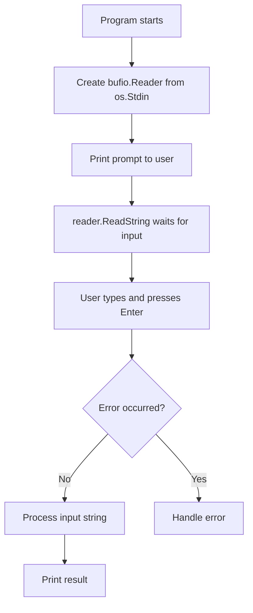

# 📦 Lecture 03 — User Input in Go

## 🧠 Concept Overview

Reading user input from the terminal uses the **`bufio`** and **`os`** packages. Go doesn't have a simple `scanf`-style input — instead, it uses a **buffered reader** pattern for robust input handling.

### Key Concepts

| Concept | Description |
|---|---|
| `bufio.NewReader()` | Creates a buffered reader wrapping an `io.Reader` |
| `os.Stdin` | Standard input stream (keyboard) |
| `ReadString('\n')` | Reads input until the delimiter character |
| Comma-ok idiom | `value, err := ...` pattern for error handling |

## 🔁 Input Flow



## 💡 Deep Dive

### The Comma-OK / Comma-Error Pattern
This is one of Go's most important idioms:
```go
input, err := reader.ReadString('\n')
```
- Functions return **multiple values** — typically `(result, error)`
- If `err` is `nil`, the operation succeeded
- If `err` is non-nil, something went wrong
- Using `_` discards a value: `input, _ := reader.ReadString('\n')`

### Why `bufio` Instead of `fmt.Scan`?
- `fmt.Scan` stops at **whitespace** — can't read full sentences
- `bufio.NewReader` reads until a **delimiter** (like `\n`) — handles spaces correctly
- `bufio` uses an internal **buffer** for efficient I/O operations

### Input Type Warning
`ReadString` always returns a **string** — even if the user types a number. You must explicitly convert it (see Lecture 04).

## 🔗 Reference Links
- [bufio Package Documentation](https://pkg.go.dev/bufio)
- [os Package — Stdin](https://pkg.go.dev/os#Stdin)
- [Go Blog – Error Handling](https://go.dev/blog/error-handling-and-go)
- [Effective Go – Multiple Return Values](https://go.dev/doc/effective_go#multiple-returns)
