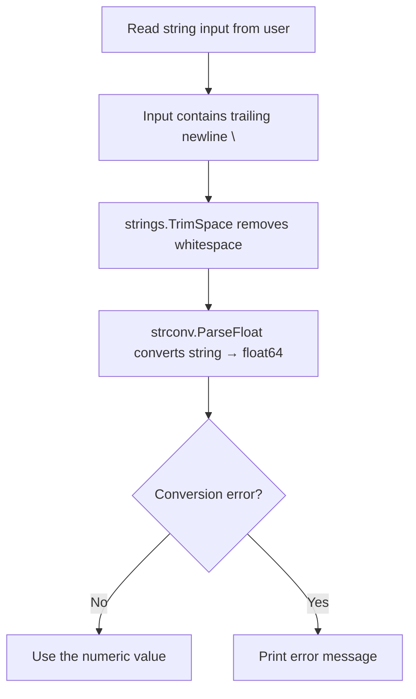

# 📦 Lecture 04 — Type Conversion in Go

## 🧠 Concept Overview

Go has **no implicit type casting** — all conversions must be explicit. This lecture demonstrates converting a **string input to a float** using the `strconv` package.

### Key Concepts

| Concept | Description |
|---|---|
| `strconv.ParseFloat()` | Converts a string to a `float64` |
| `strings.TrimSpace()` | Removes leading/trailing whitespace (including `\n`, `\r`) |
| Explicit conversion | Go never auto-converts types — you must do it manually |

## 🔁 Conversion Flow



## 💡 Deep Dive

### Why `TrimSpace` is Essential
When reading from `bufio.Reader`, the input includes the **delimiter** (`\n`) and possibly `\r` on Windows:
```
"4.5\r\n"  →  TrimSpace  →  "4.5"  →  ParseFloat  →  4.5
```
Without `TrimSpace`, `ParseFloat` would fail because `"4.5\n"` is not a valid number.

### `strconv` Package — The Type Conversion Powerhouse
| Function | Converts |
|---|---|
| `strconv.Atoi()` | string → int |
| `strconv.Itoa()` | int → string |
| `strconv.ParseFloat(s, bitSize)` | string → float32/float64 |
| `strconv.ParseBool()` | string → bool |
| `strconv.FormatFloat()` | float → string |

### The `bitSize` Parameter
```go
strconv.ParseFloat(input, 64)  // 64-bit precision (float64)
strconv.ParseFloat(input, 32)  // 32-bit precision (float32)
```
The `bitSize` parameter tells Go what precision to use during conversion.

### Go's Strict Type System
Go **refuses** to mix types:
```go
var a int = 5
var b float64 = 3.14
// c := a + b  ❌ Compile error!
c := float64(a) + b  // ✅ Explicit conversion
```

## 🔗 Reference Links
- [strconv Package Documentation](https://pkg.go.dev/strconv)
- [strings Package — TrimSpace](https://pkg.go.dev/strings#TrimSpace)
- [Go Tour – Type Conversions](https://go.dev/tour/basics/13)
- [Go Blog – Strings, bytes, runes](https://go.dev/blog/strings)
