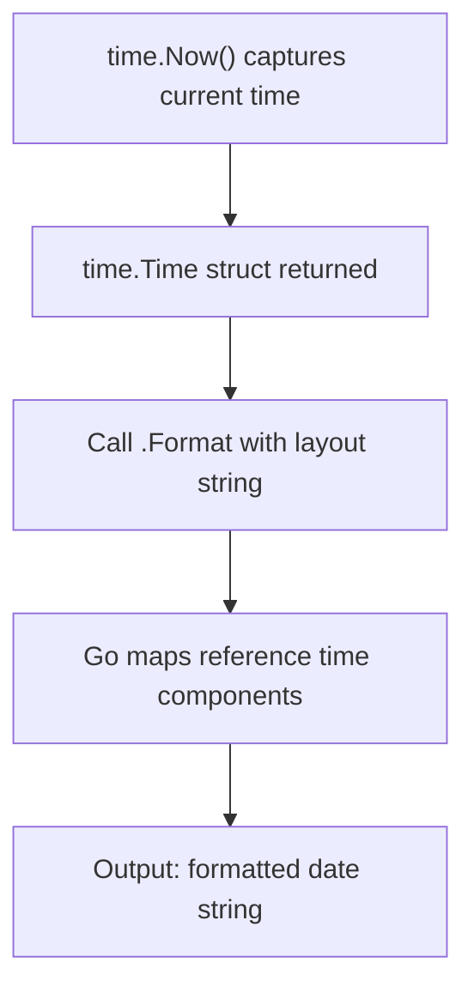

# 📦 Lecture 05 — Time Handling in Go

## 🧠 Concept Overview

Go's `time` package provides functionality for measuring and displaying time. Go uses a **unique reference time** format instead of traditional format specifiers like `YYYY-MM-DD`.

### Key Concepts

| Concept | Description |
|---|---|
| `time.Now()` | Returns the current local time |
| `time.Format()` | Formats time using Go's reference time layout |
| Reference Time | `Mon Jan 2 15:04:05 MST 2006` — Go's magic date |

## 🔁 Time Formatting Flow



## 💡 Deep Dive

### Go's Magic Reference Time
Instead of `YYYY-MM-DD HH:MM:SS`, Go uses a **specific date** as the format template:

```
Mon Jan 2 15:04:05 MST 2006
```

This is equivalent to:
| Component | Reference Value | Mnemonic |
|---|---|---|
| Month | `01` (January) | 1 |
| Day | `02` | 2 |
| Hour (24h) | `15` | 3 (PM → 15) |
| Minute | `04` | 4 |
| Second | `05` | 5 |
| Year | `2006` | 6 |
| Timezone | `MST` | 7 |

**Mnemonic**: `1-2-3-4-5-6-7` → `01/02 15:04:05 2006 MST`

### Common Format Layouts
```go
time.RFC3339      // "2006-01-02T15:04:05Z07:00"
time.Kitchen      // "3:04PM"
"01/02/2006"      // MM/DD/YYYY
"2006-01-02"      // YYYY-MM-DD (ISO 8601)
"15:04:05"        // HH:MM:SS (24-hour)
```

### The `time.Time` Struct
`time.Now()` returns a `time.Time` struct which includes:
- Wall clock time
- Monotonic clock reading (for measuring durations)
- Location (timezone)

## 🔗 Reference Links
- [time Package Documentation](https://pkg.go.dev/time)
- [Go by Example – Time Formatting](https://gobyexample.com/time-formatting-parsing)
- [Go Time Format Explained](https://www.pauladamsmith.com/blog/2011/05/go_time.html)
