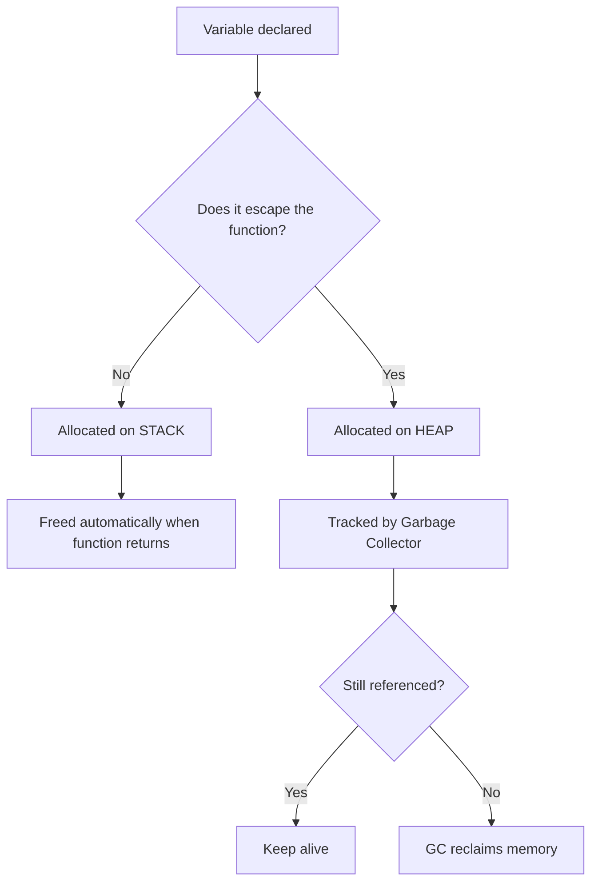
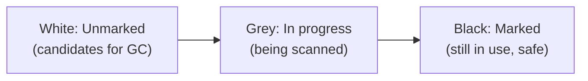

# 📦 Lecture 06 — Memory Management in Go

## 🧠 Concept Overview

Go handles memory management **automatically** through a built-in **garbage collector (GC)**. Unlike C/C++ (manual `malloc`/`free`) or Rust (ownership system), Go uses a **concurrent, tri-color mark-and-sweep** garbage collector.

### Key Concepts

| Concept | Description |
|---|---|
| Stack | Fast, automatic allocation for local variables with known size |
| Heap | Dynamic allocation for variables that escape the function scope |
| Garbage Collector | Automatically frees heap memory that is no longer referenced |
| Escape Analysis | Compiler decides if a variable goes on **stack** or **heap** |

## 🔁 Memory Allocation Flow



## 💡 Deep Dive

### Stack vs Heap

| Feature | Stack | Heap |
|---|---|---|
| Speed | ⚡ Very fast | 🐌 Slower |
| Management | Automatic (LIFO) | Garbage collected |
| Size | Limited (typically 1-8MB) | Large (system RAM) |
| Lifetime | Until function returns | Until GC reclaims |
| Use case | Local vars, small data | Pointers, closures, large data |

### Go's Garbage Collector
Go uses a **concurrent, tri-color mark-and-sweep** GC:



1. **Mark Phase**: Traverse all reachable objects from roots (globals, stack, registers)
2. **Sweep Phase**: Free all unreachable (white) objects
3. **Concurrent**: GC runs alongside your program — minimal pause times

### Escape Analysis
The compiler performs **escape analysis** at compile time to decide stack vs heap:
```go
func createOnStack() int {
    x := 42        // stays on stack — simple local variable
    return x
}

func createOnHeap() *int {
    x := 42        // escapes to heap — returned as pointer
    return &x
}
```

### `new()` vs `make()`
| Function | Purpose | Returns |
|---|---|---|
| `new(T)` | Allocates memory, zeroed | `*T` (pointer) |
| `make(T, args)` | Initializes slices, maps, channels | `T` (value) |

## 🔗 Reference Links
- [Go Blog – Garbage Collection](https://go.dev/blog/ismmkeynote)
- [Go Memory Model](https://go.dev/ref/mem)
- [Escape Analysis in Go](https://go.dev/doc/faq#stack_or_heap)
- [Understanding Allocations in Go](https://medium.com/eureka-engineering/understanding-allocations-in-go-stack-heap-memory-9a2631b5035d)
