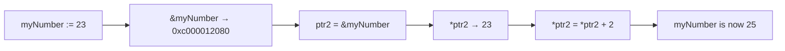

# 📦 Lecture 07 — Pointers in Go

## 🧠 Concept Overview

A **pointer** holds the **memory address** of a variable. Go supports pointers but does **not** support pointer arithmetic (unlike C/C++), making them safer.

### Key Concepts

| Concept | Syntax | Description |
|---|---|---|
| Pointer declaration | `var ptr *int` | Declares a pointer to an `int` |
| Address-of operator | `&variable` | Gets the memory address of a variable |
| Dereference operator | `*ptr` | Accesses the value stored at the pointer's address |
| Nil pointer | `var ptr *int` → `nil` | Zero value of a pointer is `nil` |

## 🔁 Pointer Operations Flow



## 💡 Deep Dive

### How Pointers Work in Memory

```
Variable:   myNumber = 23
Address:    0xc000012080

Pointer:    ptr2 = 0xc000012080  (stores the address)
Deref:      *ptr2 = 23           (follows the address to get value)
```

### Pass by Value vs Pass by Reference
By default, Go passes arguments **by value** (copies the data). Pointers allow **pass by reference**:

```go
// Pass by value — original unchanged
func increment(x int) { x++ }

// Pass by reference — original modified
func increment(x *int) { *x++ }
```

### Why No Pointer Arithmetic?
Go intentionally omits pointer arithmetic to prevent:
- Buffer overflow vulnerabilities
- Dangling pointer bugs
- Memory corruption

This makes Go **memory-safe** while still allowing low-level memory access.

### Nil Pointer Check
Always check for `nil` before dereferencing:
```go
var ptr *int  // ptr is nil
// *ptr → PANIC: nil pointer dereference
if ptr != nil {
    fmt.Println(*ptr)
}
```

## 🔗 Reference Links
- [Go Tour – Pointers](https://go.dev/tour/moretypes/1)
- [Go by Example – Pointers](https://gobyexample.com/pointers)
- [Effective Go – Pointers vs Values](https://go.dev/doc/effective_go#pointers_vs_values)
