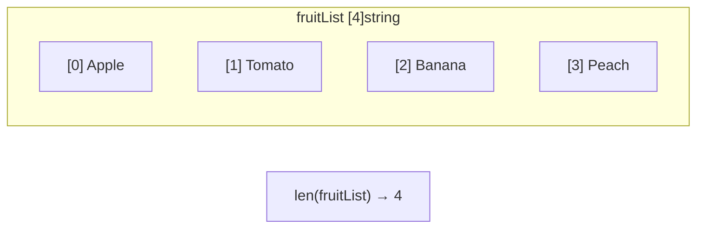

# 📦 Lecture 08 — Arrays in Go

## 🧠 Concept Overview

Arrays in Go are **fixed-size**, **value-type** collections of elements with the **same data type**. The size is part of the array's type — `[4]string` and `[5]string` are **different types**.

### Key Concepts

| Concept | Description |
|---|---|
| Fixed size | Array length is defined at declaration and cannot change |
| Zero-indexed | First element is at index `0` |
| Value type | Assigning an array **copies** all elements |
| `len()` | Returns the number of elements in the array |

## 🔁 Array Memory Layout



## 💡 Deep Dive

### Declaration Patterns
```go
// Method 1: Declare then assign
var fruitList [4]string
fruitList[0] = "Apple"

// Method 2: Shorthand with values
fruitList := [4]string{"Apple", "Tomato", "Banana", "Peach"}

// Method 3: Let compiler count
fruitList := [...]string{"Apple", "Tomato", "Banana", "Peach"}
```

### Arrays are Value Types
When you assign an array to another variable, Go creates a **full copy**:
```go
a := [3]int{1, 2, 3}
b := a      // b is a COPY of a
b[0] = 99   // only b changes, a stays [1, 2, 3]
```
This is different from most languages where arrays are reference types.

### Arrays vs Slices
| Feature | Array | Slice |
|---|---|---|
| Size | Fixed at compile time | Dynamic |
| Type | `[N]T` | `[]T` |
| Assignment | Copies data | Shares underlying array |
| Use case | Rare in practice | Very common in Go |

> **In practice, slices (Lecture 09) are used almost exclusively.** Arrays are the building blocks that slices are built upon.

## 🔗 Reference Links
- [Go Tour – Arrays](https://go.dev/tour/moretypes/6)
- [Go by Example – Arrays](https://gobyexample.com/arrays)
- [Go Spec – Array Types](https://go.dev/ref/spec#Array_types)
