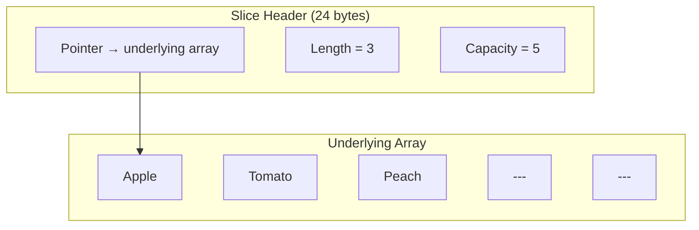
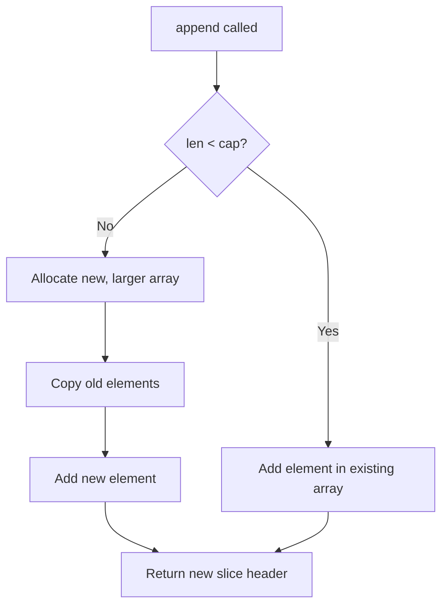

# 📦 Lecture 09 — Slices in Go

## 🧠 Concept Overview

Slices are Go's **dynamic, flexible** view into an underlying array. They are the most commonly used data structure in Go for working with sequences of data.

### Key Concepts

| Concept | Description |
|---|---|
| `[]T` | Slice type (no fixed length) |
| `append()` | Adds elements, may allocate new underlying array |
| `make()` | Creates a slice with specified length and capacity |
| Slicing `[low:high]` | Creates a sub-slice (high is exclusive) |
| `sort` package | Provides sorting and search functions |

## 🔁 Slice Internal Structure



## 💡 Deep Dive

### How `append()` Works



When capacity is exceeded, Go typically **doubles** the capacity (up to 1024 elements, then grows by ~25%).

### Slicing Operations
```go
fruit := []string{"Apple", "Tomato", "Peach", "Mango", "Banana"}
fruit[1:4]  // ["Tomato", "Peach", "Mango"]  — index 1,2,3 (4 exclusive)
fruit[:3]   // ["Apple", "Tomato", "Peach"]   — from start
fruit[2:]   // ["Peach", "Mango", "Banana"]   — to end
```

### Removing Elements from a Slice
Go has no built-in `delete` for slices. The pattern is:
```go
// Remove element at index i
slice = append(slice[:i], slice[i+1:]...)
```

### `make()` for Pre-allocation
```go
highScores := make([]int, 4)       // length=4, capacity=4
highScores := make([]int, 4, 10)   // length=4, capacity=10
```
Pre-allocation avoids repeated memory allocations during `append()`.

### Sorting with `sort` Package
```go
sort.Ints(slice)                    // Sort in ascending order
sort.IntsAreSorted(slice)          // Check if sorted → bool
sort.Strings(stringSlice)          // Sort strings
sort.Sort(sort.Reverse(sort.IntSlice(s)))  // Descending
```

### ⚠️ Gotcha: Slice Shares Memory
```go
a := []int{1, 2, 3, 4, 5}
b := a[1:3]   // b = [2, 3]
b[0] = 99     // a is now [1, 99, 3, 4, 5]!
```
Sub-slices share the same underlying array. Use `copy()` to create independent copies.

## 🔗 Reference Links
- [Go Tour – Slices](https://go.dev/tour/moretypes/7)
- [Go Blog – Slices: Usage and Internals](https://go.dev/blog/slices-intro)
- [Go by Example – Slices](https://gobyexample.com/slices)
- [sort Package Documentation](https://pkg.go.dev/sort)
