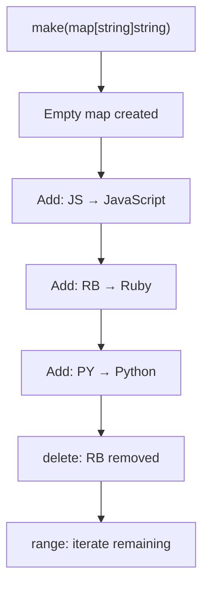

# 📦 Lecture 10 — Maps in Go

## 🧠 Concept Overview

Maps are Go's built-in **hash table** implementation — an unordered collection of **key-value pairs**. They provide **O(1) average** lookups, inserts, and deletes.

### Key Concepts

| Concept | Description |
|---|---|
| `make(map[K]V)` | Creates an initialized, empty map |
| `map[key] = value` | Sets a key-value pair |
| `delete(map, key)` | Removes a key-value pair |
| `range` | Iterates over all key-value pairs |

## 🔁 Map Operations Flow



## 💡 Deep Dive

### Map Declaration Patterns
```go
// Method 1: make
languages := make(map[string]string)

// Method 2: literal
languages := map[string]string{
    "JS": "JavaScript",
    "RB": "Ruby",
    "PY": "Python",
}

// Method 3: var (nil map — can read, CANNOT write)
var languages map[string]string  // nil map!
```
> ⚠️ A `nil` map will **panic on write** — always use `make()` or literal syntax.

### The Comma-OK Idiom for Maps
```go
value, ok := languages["JS"]
if ok {
    fmt.Println("Found:", value)  // "JavaScript"
} else {
    fmt.Println("Key not found")
}
```
This pattern distinguishes between "key doesn't exist" and "key exists with zero value".

### Iteration Order is Random
```go
for key, value := range languages {
    fmt.Println(key, "→", value)
}
// ⚠️ Order is NOT guaranteed and changes between runs!
```
This is by design — Go randomizes map iteration to prevent code from depending on order.

### Maps are Reference Types
```go
a := map[string]int{"x": 1}
b := a        // b REFERENCES the same map
b["x"] = 99   // a["x"] is also 99!
```

### Map Thread Safety
Maps are **NOT safe for concurrent use**. For concurrent access, use:
- `sync.RWMutex` for manual locking
- `sync.Map` for built-in concurrent map

## 🔗 Reference Links
- [Go Tour – Maps](https://go.dev/tour/moretypes/19)
- [Go Blog – Maps in Action](https://go.dev/blog/maps)
- [Go by Example – Maps](https://gobyexample.com/maps)
- [sync.Map Documentation](https://pkg.go.dev/sync#Map)
