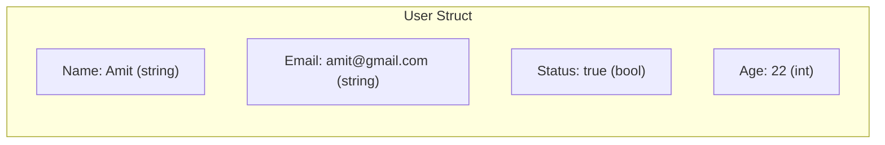

# 📦 Lecture 11 — Structs in Go

## 🧠 Concept Overview

Structs are Go's way of creating **custom, composite data types** — grouping related fields together. Go does **not have classes**; structs combined with methods (Lecture 16) serve as Go's approach to object-oriented design.

### Key Concepts

| Concept | Description |
|---|---|
| `type Name struct {}` | Defines a new struct type |
| Field access | `instance.FieldName` |
| Struct literal | `User{"Amit", "amit@gmail.com", true, 22}` |
| `%v` / `%+v` | Print struct values / with field names |

## 🔁 Struct Memory Layout



## 💡 Deep Dive

### Struct Definition & Initialization
```go
type User struct {
    Name   string
    Email  string
    Status bool
    Age    int
}

// Positional initialization (order matters)
amit := User{"Amit", "amit@gmail.com", true, 22}

// Named fields (order doesn't matter, safer)
amit := User{
    Name:   "Amit",
    Email:  "amit@gmail.com",
    Status: true,
    Age:    22,
}
```

### Format Verbs for Structs
```go
fmt.Printf("%v\n", amit)    // {Amit amit@gmail.com true 22}
fmt.Printf("%+v\n", amit)   // {Name:Amit Email:amit@gmail.com Status:true Age:22}
fmt.Printf("%#v\n", amit)   // main.User{Name:"Amit", Email:"amit@gmail.com", ...}
```

### Structs are Value Types
Assigning a struct **copies** all fields:
```go
amit2 := amit       // Full copy — independent
amit2.Age = 25      // Only amit2 changes
```
Use pointers for **shared references**:
```go
amitPtr := &amit    // Pointer to original
amitPtr.Age = 25    // Modifies original
```

### Exported vs Unexported Fields
- `Name` (capital) → Exported — visible outside the package
- `name` (lowercase) → Unexported — only within the package

### Struct Embedding (Composition over Inheritance)
```go
type Address struct { City string }
type Employee struct {
    User            // Embedded — inherits all fields
    Address         // Can embed multiple structs
    Salary  int
}
```

## 🔗 Reference Links
- [Go Tour – Structs](https://go.dev/tour/moretypes/2)
- [Go by Example – Structs](https://gobyexample.com/structs)
- [Effective Go – Embedding](https://go.dev/doc/effective_go#embedding)
