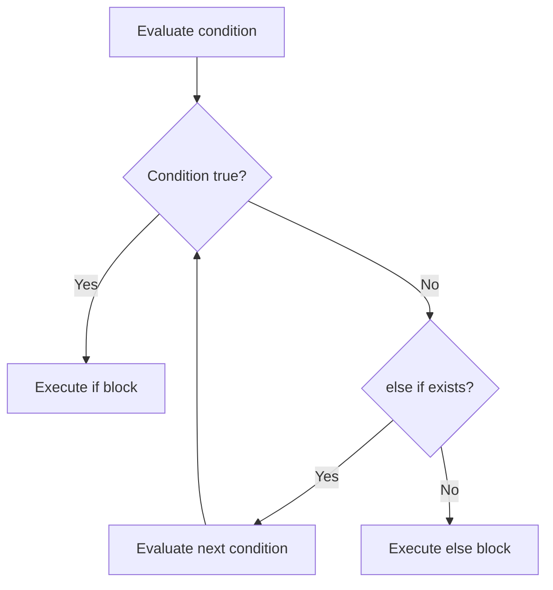

# 📦 Lecture 12 — If/Else in Go

## 🧠 Concept Overview

Go's `if/else` is similar to other languages but with **key differences**: braces `{}` are **mandatory**, parentheses `()` are **not required**, and you can declare variables **inside the if statement** with limited scope.

### Key Concepts

| Concept | Description |
|---|---|
| `if condition {}` | No parentheses around condition |
| `if/else if/else` | Standard chaining |
| `if init; condition {}` | Variable scoped to if/else block |
| Braces required | Even for single-line bodies |

## 🔁 If/Else Decision Flow



## 💡 Deep Dive

### If with Initialization Statement
Go allows declaring a variable in the `if` statement — it's scoped to the `if/else` block only:
```go
if num := 10; num > 5 {
    fmt.Println(num, "is greater than 5")  // num accessible here
} else {
    fmt.Println(num, "is not greater than 5")  // and here
}
// fmt.Println(num) ← ❌ Compile error: num is out of scope
```

### Idiomatic Error Handling with If
This is Go's most common pattern:
```go
result, err := someFunction()
if err != nil {
    log.Fatal(err)     // Handle error and exit
}
// Continue with result...
```

### No Ternary Operator
Go intentionally **does not have** a ternary operator (`? :`):
```go
// ❌ Not valid Go
// result := condition ? "yes" : "no"

// ✅ Go way
var result string
if condition {
    result = "yes"
} else {
    result = "no"
}
```
This is a design choice for **readability** over conciseness.

## 🔗 Reference Links
- [Go Tour – If](https://go.dev/tour/flowcontrol/5)
- [Go Tour – If with Short Statement](https://go.dev/tour/flowcontrol/6)
- [Effective Go – If](https://go.dev/doc/effective_go#if)
