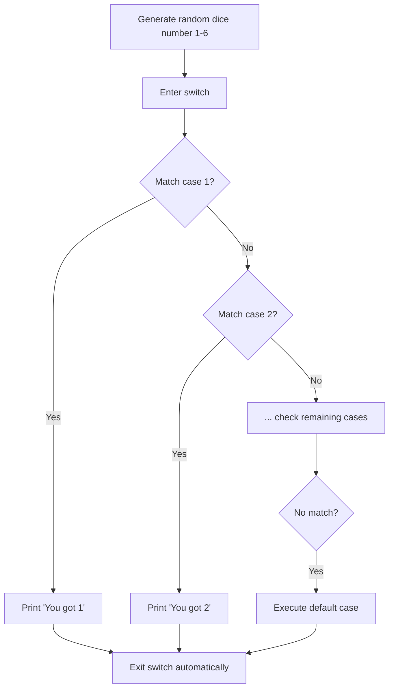

# 📦 Lecture 13 — Switch/Case in Go

## 🧠 Concept Overview

Go's `switch` statement is cleaner than C/Java — it **does not fall through** by default (no `break` needed). It also supports switch without a condition (acts as a clean `if/else` chain).

### Key Concepts

| Concept | Description |
|---|---|
| Auto-break | Cases don't fall through by default |
| `fallthrough` | Explicitly enables fall-through |
| Expressionless switch | `switch {}` acts like `if/else` |
| `rand.Seed()` | Seeds the random number generator |

## 🔁 Switch Execution Flow



## 💡 Deep Dive

### No Fall-Through (Safety Feature)
```go
// Go — only matching case runs
switch x {
case 1: fmt.Println("one")    // ← only this runs if x==1
case 2: fmt.Println("two")
}

// C/Java — falls through without break!
// switch(x) { case 1: printf("one"); case 2: printf("two"); }
// If x==1, BOTH "one" and "two" print
```

### Explicit `fallthrough`
```go
switch 1 {
case 1:
    fmt.Println("one")
    fallthrough          // deliberately continue to next case
case 2:
    fmt.Println("two")   // also runs!
}
```

### Multi-Value Cases
```go
switch day {
case "Saturday", "Sunday":
    fmt.Println("Weekend!")
case "Monday", "Tuesday", "Wednesday", "Thursday", "Friday":
    fmt.Println("Weekday")
}
```

### Expressionless Switch (Clean If/Else)
```go
switch {
case score >= 90: fmt.Println("A")
case score >= 80: fmt.Println("B")
case score >= 70: fmt.Println("C")
default:          fmt.Println("F")
}
```

### Random Number Generation
```go
rand.Seed(time.Now().UnixNano())  // Seed with current time
diceNumber := rand.Intn(6) + 1    // Random int in [1, 6]
```
> **Note:** Since Go 1.20, the default source is auto-seeded, so `rand.Seed` is deprecated.

## 🔗 Reference Links
- [Go Tour – Switch](https://go.dev/tour/flowcontrol/9)
- [Go by Example – Switch](https://gobyexample.com/switch)
- [math/rand Package](https://pkg.go.dev/math/rand)
