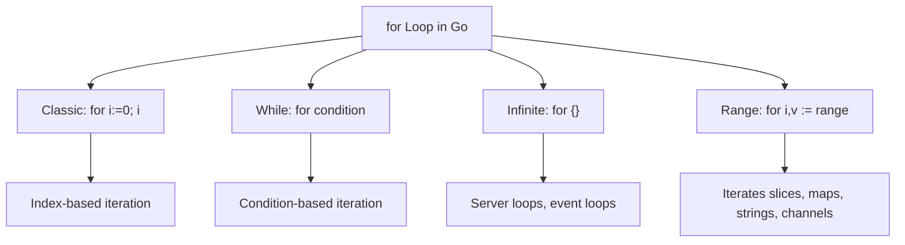

# 📦 Lecture 14 — Loops in Go

## 🧠 Concept Overview

Go has **only one looping construct**: the `for` loop. It replaces `while`, `do-while`, and `for-each` from other languages. It's versatile enough to handle all iteration patterns.

### Key Concepts

| Pattern | Syntax | Equivalent |
|---|---|---|
| Classic for | `for i := 0; i < n; i++` | C-style for loop |
| While-style | `for condition {}` | `while` loop |
| Infinite loop | `for {}` | `while(true)` |
| Range-based | `for i, v := range collection` | `for-each` |
| `continue` | Skips current iteration | |
| `break` | Exits the loop | |
| `goto` | Jumps to a labeled statement | |

## 🔁 Loop Types Flow



## 💡 Deep Dive

### The `range` Keyword
`range` returns **two values** on each iteration:
```go
for index, value := range days {
    fmt.Println(index, value)
}
// Use _ to discard a value:
for _, value := range days {  // ignore index
    fmt.Println(value)
}
```

### `range` Works With Many Types
| Type | First Value | Second Value |
|---|---|---|
| Slice/Array | index `int` | element `T` |
| Map | key `K` | value `V` |
| String | index `int` | rune `int32` |
| Channel | element `T` | — |

### `goto` Statement
Go supports `goto` with **labels**. While generally discouraged, it can simplify cleanup code:
```go
for roughValue < 10 {
    if roughValue == 2 {
        goto lco          // Jump directly to label
    }
    roughValue++
}
lco:
fmt.Println("Jumped here!")
```
> ⚠️ `goto` **cannot jump over variable declarations** — the compiler will prevent it.

### `continue` and `break`
```go
for i := 0; i < 10; i++ {
    if i == 5 { continue }  // Skip iteration when i==5
    if i == 8 { break }     // Exit loop when i==8
    fmt.Println(i)
}
// Output: 0 1 2 3 4 6 7
```

### No `++i` (Pre-increment)
Go only supports `i++` (post-increment). `++i` is **not valid syntax**.

### No Parentheses
```go
for (i := 0; i < 10; i++)  // ❌ Wrong
for  i := 0; i < 10; i++   // ✅ Correct
```

## 🔗 Reference Links
- [Go Tour – For Loop](https://go.dev/tour/flowcontrol/1)
- [Go by Example – For](https://gobyexample.com/for)
- [Go by Example – Range](https://gobyexample.com/range)
- [Effective Go – For](https://go.dev/doc/effective_go#for)
