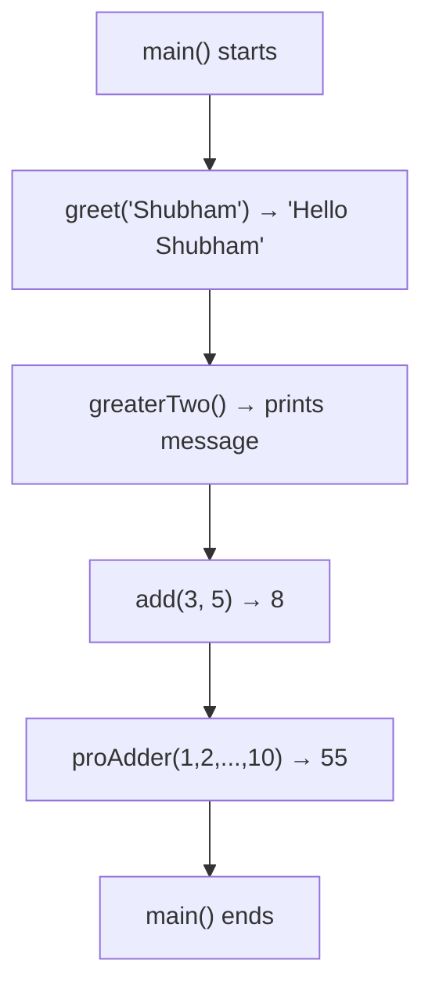

# 📦 Lecture 15 — Functions in Go

## 🧠 Concept Overview

Functions are first-class citizens in Go. Go supports **multiple return values**, **variadic functions** (accepting variable number of arguments), and **named return values**.

### Key Concepts

| Concept | Syntax | Description |
|---|---|---|
| Basic function | `func name(params) returnType` | Standard function |
| No return | `func name()` | Void equivalent |
| Multiple returns | `func name() (int, string)` | Return multiple values |
| Variadic | `func name(vals ...int)` | Variable argument count |

## 🔁 Function Call Flow



## 💡 Deep Dive

### Variadic Functions (`...`)
A function can accept a **variable number of arguments** of the same type:
```go
func proAdder(values ...int) int {
    sum := 0
    for _, value := range values {
        sum += value
    }
    return sum
}
// Usage:
proAdder(1, 2, 3)           // 3 args
proAdder(1, 2, 3, 4, 5)     // 5 args
```

Internally, `values` is a **slice** (`[]int`). You can also pass a slice using `...`:
```go
nums := []int{1, 2, 3, 4, 5}
proAdder(nums...)   // Spread operator
```

### Multiple Return Values
```go
func divide(a, b float64) (float64, error) {
    if b == 0 {
        return 0, errors.New("division by zero")
    }
    return a / b, nil
}
```

### Named Return Values (Naked Return)
```go
func split(sum int) (x, y int) {
    x = sum * 4 / 9
    y = sum - x
    return  // returns x and y automatically
}
```
> ⚠️ Named returns can reduce readability for long functions. Use sparingly.

### Functions as Values
```go
add := func(a, b int) int { return a + b }
fmt.Println(add(3, 5))  // 8
```

### Key Rules
- **All parameters must be used** — Go enforces this at compile time
- **Capitalized function names are exported** — accessible from other packages
- Go does **not support function overloading** — each name must be unique

## 🔗 Reference Links
- [Go Tour – Functions](https://go.dev/tour/basics/4)
- [Go Tour – Multiple Results](https://go.dev/tour/basics/6)
- [Go by Example – Functions](https://gobyexample.com/functions)
- [Go by Example – Variadic Functions](https://gobyexample.com/variadic-functions)
