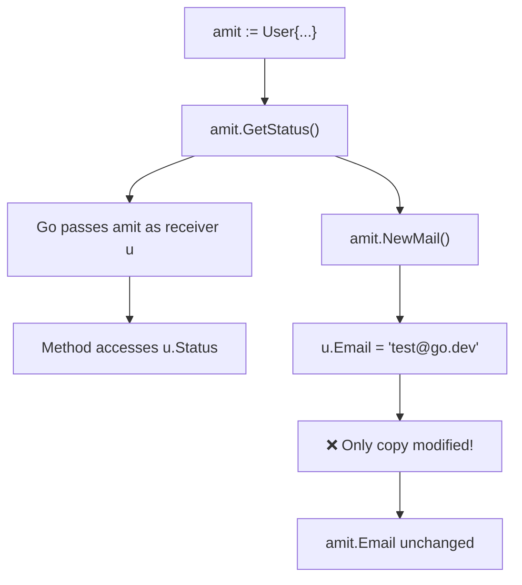

# 📦 Lecture 16 — Methods in Go

## 🧠 Concept Overview

Methods are functions with a **receiver argument** — they attach behavior to types (usually structs). This is Go's approach to **object-oriented programming** without classes or inheritance.

### Key Concepts

| Concept | Description |
|---|---|
| Method receiver | `func (u User) MethodName()` — attaches method to `User` |
| Value receiver | Operates on a **copy** of the struct |
| Pointer receiver | `func (u *User) MethodName()` — modifies the original |
| Method call | `instance.MethodName()` |

## 🔁 Method Dispatch Flow



## 💡 Deep Dive

### Value Receiver vs Pointer Receiver

```go
// VALUE receiver — works on a COPY
func (u User) NewMail() {
    u.Email = "test@go.dev"  // Only modifies the copy!
    fmt.Println(u.Email)     // Prints "test@go.dev"
}
// amit.Email is STILL "amit@gmail.com"

// POINTER receiver — modifies the ORIGINAL
func (u *User) NewMail() {
    u.Email = "test@go.dev"  // Modifies the actual struct!
}
// amit.Email is NOW "test@go.dev"
```

### When to Use Which?

| Use Case | Receiver Type |
|---|---|
| Reading fields only | Value `(u User)` |
| Modifying fields | Pointer `(u *User)` |
| Large structs | Pointer (avoids copying) |
| Consistency | If one method needs pointer, use pointer for all |

### Methods vs Functions
```go
// Function — standalone
func GetAge(u User) { fmt.Println(u.Age) }
GetAge(amit)

// Method — attached to type
func (u User) GetAge() { fmt.Println(u.Age) }
amit.GetAge()
```

### Methods on Non-Struct Types
You can define methods on **any named type** (not just structs):
```go
type MyFloat float64

func (f MyFloat) Abs() float64 {
    if f < 0 { return float64(-f) }
    return float64(f)
}
```

### Go's OOP Philosophy
Go uses **composition over inheritance**:
- No classes — use structs + methods
- No inheritance — use struct embedding
- No method overriding — use interfaces (implicit implementation)

## 🔗 Reference Links
- [Go Tour – Methods](https://go.dev/tour/methods/1)
- [Go Tour – Pointer Receivers](https://go.dev/tour/methods/4)
- [Effective Go – Methods](https://go.dev/doc/effective_go#methods)
- [Go by Example – Methods](https://gobyexample.com/methods)
