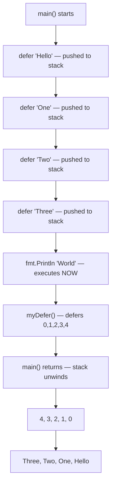

# 📦 Lecture 17 — Defer in Go

## 🧠 Concept Overview

`defer` postpones the execution of a function until the **surrounding function returns**. Deferred calls are pushed onto a **stack** (LIFO — Last In, First Out), so they execute in **reverse order**.

### Key Concepts

| Concept | Description |
|---|---|
| `defer func()` | Schedules function to run after surrounding function returns |
| LIFO order | Last deferred = first executed |
| Evaluated immediately | Arguments are **evaluated at defer time**, not execution time |

## 🔁 Defer Execution Order



### Expected Output
```
World
4
3
2
1
0
Three
Two
One
Hello
```

## 💡 Deep Dive

### The Defer Stack (LIFO)
```go
defer fmt.Println("First")   // Bottom of stack
defer fmt.Println("Second")
defer fmt.Println("Third")   // Top of stack
// Output: Third → Second → First
```

### Arguments Evaluated at Defer Time
```go
x := 10
defer fmt.Println(x)  // x=10 is captured NOW
x = 20
// Output: 10 (not 20!)
```

### Common Use Cases

#### 1. Resource Cleanup (Most Common)
```go
file, _ := os.Open("data.txt")
defer file.Close()  // Guaranteed cleanup
// ... work with file
```

#### 2. Mutex Unlocking
```go
mu.Lock()
defer mu.Unlock()
// ... critical section
```

#### 3. Recovering from Panics
```go
defer func() {
    if r := recover(); r != nil {
        fmt.Println("Recovered from:", r)
    }
}()
panic("something went wrong")
```

### Defer in Loops
```go
for i := 0; i < 5; i++ {
    defer fmt.Println(i)
}
// Output: 4, 3, 2, 1, 0  (LIFO)
```
> ⚠️ Be cautious with `defer` in loops — deferred calls accumulate and only execute when the **function exits**, not when the loop iteration ends.

### Performance Note
`defer` has a small overhead. In **hot loops** (millions of iterations), consider manual cleanup instead.

## 🔗 Reference Links
- [Go Tour – Defer](https://go.dev/tour/flowcontrol/12)
- [Go Tour – Stacking Defers](https://go.dev/tour/flowcontrol/13)
- [Go Blog – Defer, Panic, and Recover](https://go.dev/blog/defer-panic-and-recover)
- [Effective Go – Defer](https://go.dev/doc/effective_go#defer)
