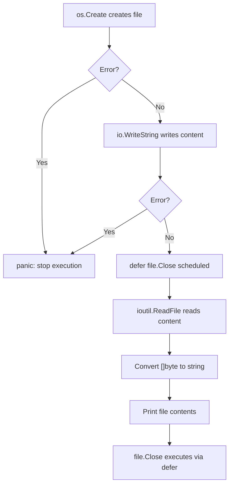

# 📦 Lecture 18 — File Operations in Go

## 🧠 Concept Overview

Go provides powerful file I/O through the `os`, `io`, and `io/ioutil` packages. This lecture covers **creating files**, **writing content**, and **reading files** with proper error handling.

### Key Concepts

| Concept | Description |
|---|---|
| `os.Create()` | Creates a new file (or truncates existing) |
| `io.WriteString()` | Writes a string to an `io.Writer` |
| `ioutil.ReadFile()` | Reads entire file into memory |
| `defer file.Close()` | Ensures file handle is properly closed |
| `panic(err)` | Immediately stops program on critical error |

## 🔁 File Operations Flow



## 💡 Deep Dive

### File Creation and Writing
```go
file, err := os.Create("./myfile.txt")  // Creates or truncates
if err != nil {
    panic(err)  // Critical error — can't continue
}
defer file.Close()

length, err := io.WriteString(file, "Hello, Go!")
fmt.Println("Wrote", length, "bytes")
```

### Reading Files
```go
// Method 1: Read entire file (simple but memory-heavy for large files)
data, err := ioutil.ReadFile("myfile.txt")
content := string(data)  // []byte → string

// Method 2: Read with os.Open + bufio (better for large files)
file, _ := os.Open("myfile.txt")
scanner := bufio.NewScanner(file)
for scanner.Scan() {
    fmt.Println(scanner.Text())  // Line by line
}
```

### `panic` vs `log.Fatal` vs Error Return

| Approach | Use When |
|---|---|
| `panic(err)` | Unrecoverable internal error |
| `log.Fatal(err)` | Graceful exit with logging |
| `return err` | Let caller decide how to handle (preferred) |

### File Open Modes
```go
os.Create(name)         // Create/truncate, read+write
os.Open(name)           // Read-only
os.OpenFile(name, flag, perm)  // Full control

// Common flags:
os.O_RDONLY   // Read-only
os.O_WRONLY   // Write-only
os.O_RDWR     // Read-write
os.O_APPEND   // Append to file
os.O_CREATE   // Create if not exists
os.O_TRUNC    // Truncate on open
```

### Reusable Error Checker Pattern
```go
func checkNilError(err error) {
    if err != nil {
        panic(err)
    }
}
```
This pattern reduces repetitive error checking, though idiomatic Go prefers inline checking.

### ⚠️ Deprecation Notice
`ioutil.ReadFile` is **deprecated since Go 1.16**. Use `os.ReadFile` instead:
```go
data, err := os.ReadFile("myfile.txt")  // Modern replacement
```

## 🔗 Reference Links
- [os Package Documentation](https://pkg.go.dev/os)
- [io Package Documentation](https://pkg.go.dev/io)
- [Go by Example – Reading Files](https://gobyexample.com/reading-files)
- [Go by Example – Writing Files](https://gobyexample.com/writing-files)
