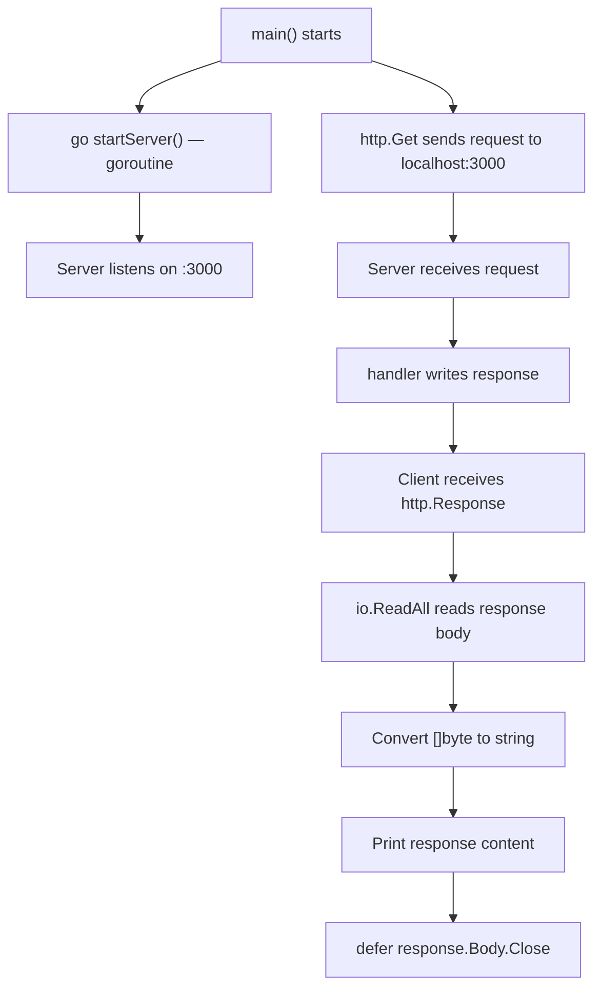

# 📦 Lecture 19 — Web Requests in Go

## 🧠 Concept Overview

Go's `net/http` package is one of its most powerful standard library packages — capable of both **serving HTTP** and **making HTTP requests** without any third-party libraries.

### Key Concepts

| Concept | Description |
|---|---|
| `http.Get(url)` | Makes an HTTP GET request |
| `http.HandleFunc()` | Registers a handler for a URL pattern |
| `http.ListenAndServe()` | Starts an HTTP server |
| `go func()` | Goroutine — runs function concurrently |
| `defer response.Body.Close()` | Ensures response body is cleaned up |

## 🔁 Server + Client Flow



## 💡 Deep Dive

### HTTP Server in Go
```go
func handler(w http.ResponseWriter, r *http.Request) {
    fmt.Fprintln(w, "Hello, you've reached the server!")
}

func startServer() {
    http.HandleFunc("/", handler)
    http.ListenAndServe(":3000", nil)
}
```
- `http.ResponseWriter` — write the response back to client
- `*http.Request` — contains all request data (headers, body, URL, method)
- `:3000` — listen on all interfaces, port 3000
- `nil` — use the default `ServeMux` (router)

### HTTP Client (Making Requests)
```go
response, err := http.Get(url)
if err != nil {
    panic(err)
}
defer response.Body.Close()  // ALWAYS close the body!

databytes, err := io.ReadAll(response.Body)
content := string(databytes)
```

### The `http.Response` Struct
```go
response.StatusCode      // 200, 404, 500, etc.
response.Status          // "200 OK"
response.Header          // Response headers (map)
response.Body            // io.ReadCloser — the response data
response.ContentLength   // Size in bytes (-1 if unknown)
```

### Goroutines for Concurrency
```go
go startServer()  // Runs server in a separate goroutine
```
The `go` keyword launches a **lightweight thread** (goroutine). This allows the server and client to run **concurrently** in the same program.

### ⚠️ Why `response.Body.Close()` is Critical
The response body is a **stream** connected to a TCP socket. If not closed:
- File descriptors leak
- TCP connections remain open
- Eventually: `too many open files` error

## 🔗 Reference Links
- [net/http Package Documentation](https://pkg.go.dev/net/http)
- [Go by Example – HTTP Servers](https://gobyexample.com/http-servers)
- [Go by Example – HTTP Clients](https://gobyexample.com/http-clients)
- [Go Blog – HTTP/2 Server Push](https://go.dev/blog/h2push)
