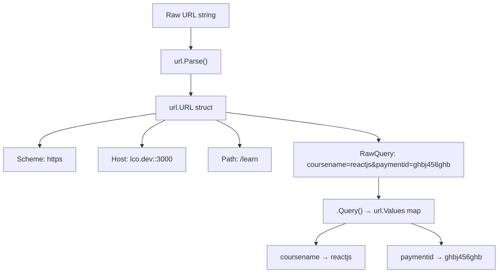

# 📦 Lecture 20 — URL Handling in Go

## 🧠 Concept Overview

Go's `net/url` package provides comprehensive URL **parsing**, **construction**, and **query parameter** manipulation. It follows the RFC 3986 standard for URI syntax.

### Key Concepts

| Concept | Description |
|---|---|
| `url.Parse()` | Parses a raw URL string into components |
| `url.URL` struct | Structured representation of a URL |
| `url.Values` | Map of query parameters |
| `.Query()` | Extracts query parameters as `url.Values` |
| `.String()` | Reconstructs URL from components |

## 🔁 URL Parsing Flow



## 💡 Deep Dive

### URL Anatomy
```
https://lco.dev:3000/learn?coursename=reactjs&paymentid=ghbj456ghb
└─┬──┘ └──┬───┘└┬─┘└─┬──┘└──────────────┬─────────────────────────┘
Scheme   Host  Port  Path            Query Parameters
```

### Parsing a URL
```go
result, _ := url.Parse(rawUrl)
result.Scheme     // "https"
result.Host       // "lco.dev:3000"
result.Path       // "/learn"
result.Port()     // "3000"
result.RawQuery   // "coursename=reactjs&paymentid=ghbj456ghb"
```

### Working with Query Parameters
```go
qparams := result.Query()                  // url.Values (map[string][]string)
qparams["coursename"]                      // ["reactjs"]
qparams.Get("coursename")                  // "reactjs" (first value)
qparams.Set("coursename", "golang")        // Replace
qparams.Add("coursename", "python")        // Add additional value
qparams.Del("paymentid")                   // Delete
qparams.Encode()                           // URL-encoded string
```

### Constructing URLs Programmatically
```go
partOfUrl := &url.URL{
    Scheme: "https",
    Host:   "lco.dev",
    Path:   "/tutcss",
}
finalUrl := partOfUrl.String()  // "https://lco.dev/tutcss"
```
This is **safer** than string concatenation — it handles encoding automatically.

### `url.Values` Type
`url.Values` is actually `map[string][]string` — each key can have **multiple values** (like checkboxes in forms):
```go
values := url.Values{}
values.Add("color", "red")
values.Add("color", "blue")
// values["color"] = ["red", "blue"]
values.Encode()  // "color=red&color=blue"
```

### URL Encoding/Escaping
```go
url.PathEscape("hello world")     // "hello%20world"
url.QueryEscape("hello world")    // "hello+world"
url.PathUnescape("hello%20world") // "hello world"
```

## 🔗 Reference Links
- [net/url Package Documentation](https://pkg.go.dev/net/url)
- [Go by Example – URL Parsing](https://gobyexample.com/url-parsing)
- [RFC 3986 — URI Syntax](https://datatracker.ietf.org/doc/html/rfc3986)
