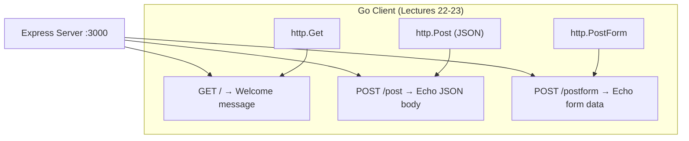

# 📦 Lecture 21 — Foundation Server (Express.js Backend)

## 🧠 Concept Overview

This lecture sets up a **Node.js/Express server** that acts as a backend for testing Go's HTTP client capabilities (Lectures 22-23). It exposes endpoints for **GET**, **POST (JSON)**, and **POST (form)** requests.

### Key Concepts

| Concept | Description |
|---|---|
| `express()` | Creates an Express application |
| `app.get()` | Handles GET requests |
| `app.post()` | Handles POST requests |
| `express.json()` | Middleware to parse JSON body |
| `express.urlencoded()` | Middleware to parse form data |

## 🔁 Server Architecture



## 💡 Deep Dive

### Middleware Pipeline
```javascript
app.use(express.json())                      // Parse JSON bodies
app.use(express.urlencoded({ extended: true })) // Parse URL-encoded forms
```
These middlewares run **before** route handlers and populate `req.body`.

### Endpoints

| Endpoint | Method | Input | Output |
|---|---|---|---|
| `/` | GET | None | `"Welcome to my server"` |
| `/post` | POST | JSON body | Echoes back the JSON |
| `/postform` | POST | Form data | Echoes back as JSON string |

### Why an Express Server?
Go lectures 22-23 demonstrate Go's HTTP **client** capabilities. This Express server:
- Provides a real API to make requests against
- Demonstrates the **interoperability** between Go and Node.js
- Shows how Go can consume REST APIs

### Running the Server
```bash
npm install          # Install dependencies
node index.js       # Start server on port 3000
```

## 🔗 Reference Links
- [Express.js Documentation](https://expressjs.com/)
- [Express API Reference](https://expressjs.com/en/4x/api.html)
- [MDN — HTTP Methods](https://developer.mozilla.org/en-US/docs/Web/HTTP/Methods)
