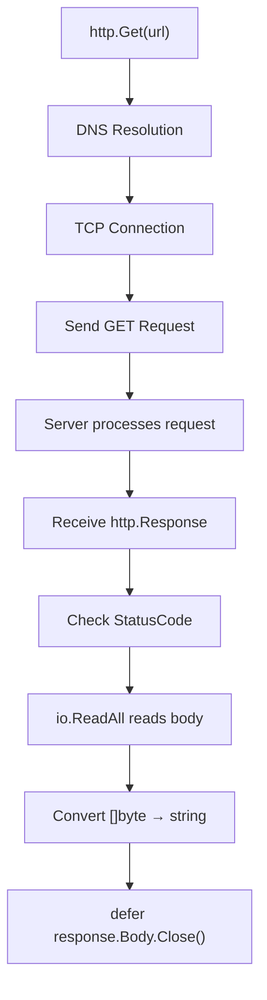

# 📦 Lecture 22 — HTTP GET Requests in Go

## 🧠 Concept Overview

This lecture demonstrates making **HTTP GET requests** from Go, processing the response, and using `strings.Builder` for efficient string construction.

### Key Concepts

| Concept | Description |
|---|---|
| `http.Get()` | Makes a GET request, returns `*http.Response` |
| `response.StatusCode` | HTTP status code (200, 404, etc.) |
| `response.ContentLength` | Size of response body in bytes |
| `io.ReadAll()` | Reads entire body into `[]byte` |
| `strings.Builder` | Efficiently builds strings from bytes |

## 🔁 GET Request Flow



## 💡 Deep Dive

### The `http.Response` Object
```go
response, err := http.Get(url)
response.StatusCode     // 200
response.ContentLength  // bytes (-1 if unknown)
response.Header         // map[string][]string
response.Body           // io.ReadCloser (stream)
```

### `strings.Builder` — Efficient String Construction
```go
var builder strings.Builder
content, _ := io.ReadAll(response.Body)
byteCount, _ := builder.Write(content)  // Write []byte
result := builder.String()               // Get final string
```

Why use `strings.Builder` instead of `string(content)`?
- For **single conversion**: `string(content)` is fine
- For **multiple concatenations**: `strings.Builder` avoids repeated memory allocation:
  ```go
  // Inefficient — creates new string each time
  s := ""
  s += "hello" + "world" + "!"  // 3 allocations
  
  // Efficient — single buffer
  var b strings.Builder
  b.WriteString("hello")
  b.WriteString("world")
  b.WriteString("!")  // 1 allocation
  ```

### Goroutine for Concurrent Server
```go
go startServer()  // Server runs in background goroutine
```
This allows running both server and client **in the same program** for testing.

### HTTP Status Codes Quick Reference
| Code | Meaning |
|---|---|
| 200 | OK — Success |
| 301 | Moved Permanently |
| 400 | Bad Request |
| 401 | Unauthorized |
| 404 | Not Found |
| 500 | Internal Server Error |

## 🔗 Reference Links
- [net/http Package — Get](https://pkg.go.dev/net/http#Get)
- [strings.Builder Documentation](https://pkg.go.dev/strings#Builder)
- [io.ReadAll Documentation](https://pkg.go.dev/io#ReadAll)
- [Go by Example — HTTP Clients](https://gobyexample.com/http-clients)
