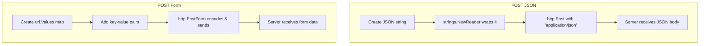

# 📦 Lecture 23 — HTTP POST & Form Requests in Go

## 🧠 Concept Overview

This lecture demonstrates making **POST requests** in Go — both with **JSON payloads** and **form data**. It covers all three HTTP verb patterns: GET, POST JSON, and POST Form.

### Key Concepts

| Concept | Description |
|---|---|
| `http.Post()` | Sends POST with a body and content type |
| `http.PostForm()` | Sends POST with URL-encoded form data |
| `strings.NewReader()` | Creates an `io.Reader` from a string |
| `url.Values{}` | Map for form key-value pairs |

## 🔁 POST Request Flows



## 💡 Deep Dive

### POST with JSON Body
```go
requestBody := strings.NewReader(`{
    "coursename": "Let's learn Go",
    "price": 299,
    "platform": "LearnCodeOnline.in"
}`)

response, err := http.Post(
    myUrl,
    "application/json",    // Content-Type header
    requestBody,           // io.Reader
)
```

### POST with Form Data
```go
data := url.Values{}
data.Add("firstname", "Rahul")
data.Add("lastname", "Shetty")
data.Add("email", "rahul@gmail.com")

response, err := http.PostForm(myUrl, data)
// Automatically sets Content-Type: application/x-www-form-urlencoded
```

### Content-Type Comparison
| Method | Content-Type | Data Format |
|---|---|---|
| `http.Post` (JSON) | `application/json` | `{"key": "value"}` |
| `http.PostForm` | `application/x-www-form-urlencoded` | `key=value&key2=value2` |
| Multipart (file upload) | `multipart/form-data` | Binary data with boundaries |

### Advanced HTTP Client
For more control, use `http.Client` and `http.NewRequest`:
```go
client := &http.Client{
    Timeout: 10 * time.Second,
}

req, _ := http.NewRequest("POST", url, body)
req.Header.Set("Content-Type", "application/json")
req.Header.Set("Authorization", "Bearer token123")

resp, err := client.Do(req)
```

### `strings.NewReader` vs `bytes.NewBuffer`
| Function | Input | Use Case |
|---|---|---|
| `strings.NewReader(s)` | string | When data is already a string |
| `bytes.NewBuffer(b)` | []byte | When data is bytes |
| `bytes.NewReader(b)` | []byte | Read-only byte reader |

## 🔗 Reference Links
- [net/http — Post](https://pkg.go.dev/net/http#Post)
- [net/http — PostForm](https://pkg.go.dev/net/http#PostForm)
- [net/url — Values](https://pkg.go.dev/net/url#Values)
- [Go by Example — HTTP Clients](https://gobyexample.com/http-clients)
