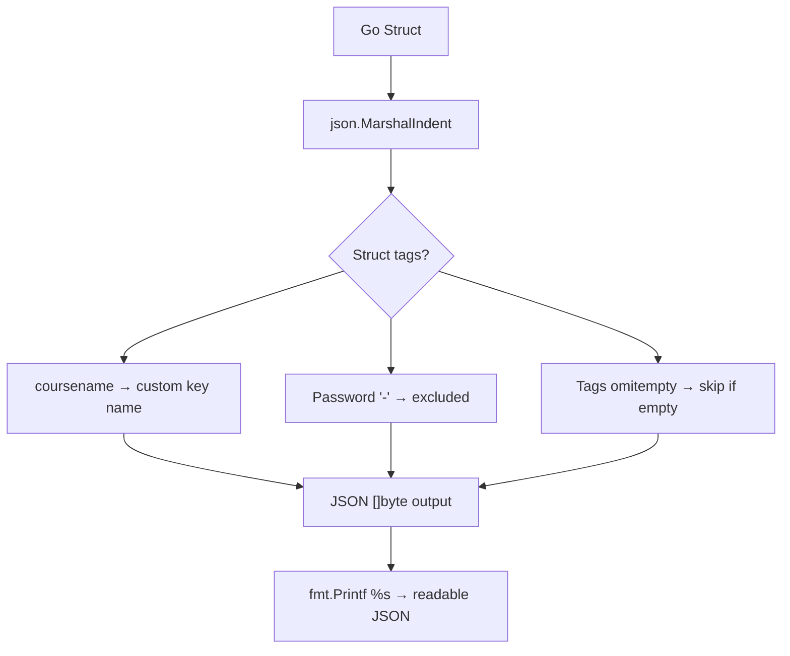

# 📦 Lecture 24 — JSON Encoding (Marshalling) in Go

## 🧠 Concept Overview

This lecture covers converting Go structs into **JSON format** using `encoding/json`. Go uses **struct tags** to control how fields are mapped to JSON keys, and supports options like `omitempty` and field exclusion.

### Key Concepts

| Concept | Description |
|---|---|
| `json.Marshal()` | Converts Go value → JSON `[]byte` |
| `json.MarshalIndent()` | Pretty-printed JSON with indentation |
| Struct tags | `` `json:"name"` `` — controls JSON key names |
| `omitempty` | Omits field if it has a zero value |
| `json:"-"` | Excludes field from JSON entirely |

## 🔁 Marshalling Flow



## 💡 Deep Dive

### Struct Tags — JSON Field Control
```go
type course struct {
    Name     string   `json:"coursename"`        // Custom JSON key
    Price    int                                   // Uses "Price" as-is
    Platform string   `json:"website"`            // Renamed to "website"
    Password string   `json:"-"`                  // ⛔ NEVER included in JSON
    Tags     []string `json:"tags,omitempty"`     // Omit if empty/nil
}
```

### Tag Options Reference
| Tag | Effect |
|---|---|
| `` `json:"name"` `` | Use "name" as JSON key |
| `` `json:"-"` `` | Exclude from JSON output |
| `` `json:"name,omitempty"` `` | Use "name", omit if zero value |
| `` `json:",omitempty"` `` | Keep original name, omit if zero value |
| `` `json:",string"` `` | Encode number/bool as JSON string |

### `Marshal` vs `MarshalIndent`
```go
// Compact — for APIs and production
json.Marshal(data)
// Output: {"coursename":"ReactJs","Price":299}

// Pretty — for debugging and logging
json.MarshalIndent(data, "", "\t")
// Output:
// {
//     "coursename": "ReactJs",
//     "Price": 299
// }
```

### Zero Values and `omitempty`
| Type | Zero Value | Omitted with `omitempty`? |
|---|---|---|
| `string` | `""` | ✅ Yes |
| `int` | `0` | ✅ Yes |
| `bool` | `false` | ✅ Yes |
| `[]T` | `nil` | ✅ Yes |
| `*T` | `nil` | ✅ Yes |

### Exported Fields Only
Only **exported** (capitalized) fields get marshalled:
```go
type User struct {
    Name string  // ✅ Included in JSON
    age  int     // ❌ Ignored (unexported)
}
```

## 🔗 Reference Links
- [encoding/json Package](https://pkg.go.dev/encoding/json)
- [Go Blog — JSON and Go](https://go.dev/blog/json)
- [Go by Example — JSON](https://gobyexample.com/json)
- [JSON Struct Tags Guide](https://www.digitalocean.com/community/tutorials/how-to-use-struct-tags-in-go)
