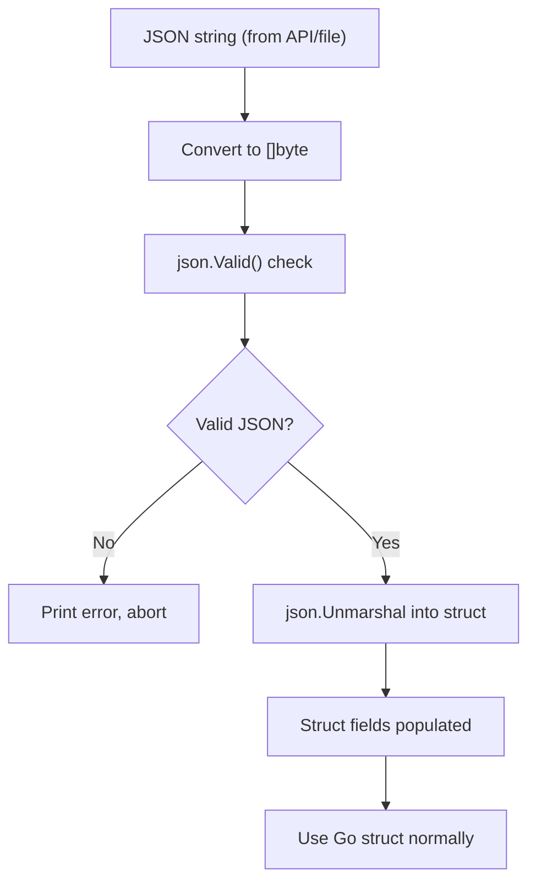

# 📦 Lecture 25 — JSON Decoding (Unmarshalling) in Go

## 🧠 Concept Overview

This lecture covers the reverse of Lecture 24 — converting **JSON data into Go structs** using `json.Unmarshal()`. It also demonstrates **validating JSON** before parsing.

### Key Concepts

| Concept | Description |
|---|---|
| `json.Unmarshal()` | Converts JSON `[]byte` → Go struct |
| `json.Valid()` | Checks if `[]byte` is valid JSON |
| `[]byte` conversion | JSON must be `[]byte`, not `string` |
| Struct mapping | JSON keys map to struct field names or tags |

## 🔁 Unmarshalling Flow



## 💡 Deep Dive

### JSON to Struct Mapping
```go
// JSON input
{"Name": "Go Bootcamp", "Price": 399, "Platform": "LearnCodingOnline.in"}

// Maps to struct
type course struct {
    Name     string   `json:"coursename"`  // "coursename" in JSON → Name field
    Price    int                             // "Price" in JSON → Price field
    Platform string   `json:"website"`     // "website" in JSON → Platform field
    Password string   `json:"-"`           // Never populated from JSON
    Tags     []string `json:"tags,omitempty"`
}
```

### Unmarshal Requires a Pointer
```go
var lcoCourses course
json.Unmarshal(jsonData, &lcoCourses)  // Must pass pointer &
//                        ^ pointer is required so Unmarshal can modify the variable
```

### Validate Before Unmarshal
```go
if json.Valid(jsonData) {
    json.Unmarshal(jsonData, &target)
} else {
    fmt.Println("Invalid JSON!")
}
```

### Format Verbs for Debugging Structs
```go
fmt.Printf("%v\n", s)    // {Go Bootcamp 399 LearnCodingOnline.in  [back-end go]}
fmt.Printf("%+v\n", s)   // {Name:Go Bootcamp Price:399 ...}
fmt.Printf("%#v\n", s)   // main.course{Name:"Go Bootcamp", Price:399, ...}
```

### Unmarshal to `map[string]interface{}`
When you don't know the JSON structure:
```go
var result map[string]interface{}
json.Unmarshal(jsonData, &result)
// result["Name"] → "Go Bootcamp" (type interface{})
// Requires type assertion: result["Name"].(string)
```

### Common Gotchas

| Issue | Cause | Fix |
|---|---|---|
| Field not populated | JSON key doesn't match struct field/tag | Check tag names |
| Zero value for field | Key missing in JSON | Use `omitempty` or pointer fields |
| Unexported field | Lowercase field name | Capitalize field name |

### Encoding vs Decoding Summary
| Direction | Function | Input | Output |
|---|---|---|---|
| Go → JSON | `json.Marshal` | Go struct | `[]byte` |
| JSON → Go | `json.Unmarshal` | `[]byte` | Go struct |
| Stream encode | `json.NewEncoder` | `io.Writer` | JSON stream |
| Stream decode | `json.NewDecoder` | `io.Reader` | Go struct |

## 🔗 Reference Links
- [encoding/json — Unmarshal](https://pkg.go.dev/encoding/json#Unmarshal)
- [Go Blog — JSON and Go](https://go.dev/blog/json)
- [Go by Example — JSON](https://gobyexample.com/json)
- [Go Spec — Struct Tags](https://go.dev/ref/spec#Struct_types)
