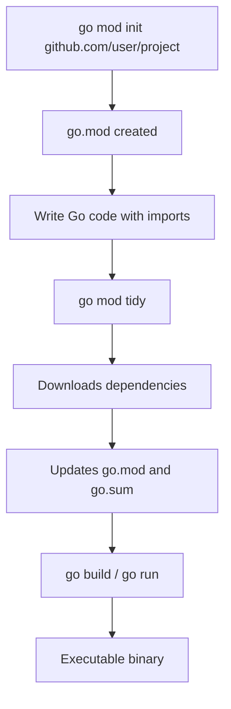

# 📦 Lecture 26 — Go Modules in Go

## 🧠 Concept Overview

Go Modules are Go's **dependency management system** (introduced in Go 1.11, default since Go 1.13). A module is a collection of Go packages with a `go.mod` file at the root that tracks dependencies.

### Key Concepts

| Concept | Description |
|---|---|
| `go.mod` | Declares the module path and Go version |
| `go.sum` | Lockfile — checksums for dependency integrity |
| `go mod init` | Initializes a new module |
| `go mod tidy` | Cleans up dependencies |
| Module path | Unique identifier, usually a repository URL |

## 🔁 Module Lifecycle



## 💡 Deep Dive

### The `go.mod` File
```go
module github.com/Amitaarav/go-module

go 1.23.2
```
- **module path**: Unique identifier, used as import prefix
- **go directive**: Minimum Go version required
- **require block**: Lists dependencies (added automatically)

### Common Module Commands

| Command | Purpose |
|---|---|
| `go mod init <path>` | Create a new module |
| `go mod tidy` | Add missing, remove unused dependencies |
| `go mod download` | Download dependencies to local cache |
| `go mod verify` | Verify dependencies haven't been tampered |
| `go mod vendor` | Copy dependencies to `vendor/` directory |
| `go mod graph` | Print dependency graph |
| `go list -m all` | List all dependencies |

### Module Path Convention
```
github.com/username/projectname
```
This allows Go to **automatically download** with `go get`:
```bash
go get github.com/username/projectname
```

### Semantic Versioning
Go modules follow **semver** (`vMAJOR.MINOR.PATCH`):
```
v1.2.3
│ │ │
│ │ └── Patch: bug fixes (backward compatible)
│ └──── Minor: new features (backward compatible)
└────── Major: breaking changes
```

### Major Version Paths
For v2+, the module path **must include the major version**:
```go
module github.com/user/project/v2  // v2.x.x
```
This allows `v1` and `v2` to coexist in the same project.

### `GOPATH` vs Go Modules
| Feature | GOPATH (old) | Go Modules (new) |
|---|---|---|
| Location | Fixed `$GOPATH/src` | Any directory |
| Versioning | None | Semantic versioning |
| Dependency file | None | `go.mod` + `go.sum` |
| Reproducibility | ❌ | ✅ Lockfile ensures it |

### go.sum — Integrity Verification
```
github.com/pkg/errors v0.9.1 h1:FEBLx1zS214owpjy7qsBeix...
github.com/pkg/errors v0.9.1/go.mod h1:bwawxfHBFNV+L2hUp...
```
Each entry contains a **cryptographic hash** to verify the dependency hasn't been modified.

## 🔗 Reference Links
- [Go Modules Reference](https://go.dev/ref/mod)
- [Go Blog — Using Go Modules](https://go.dev/blog/using-go-modules)
- [Go Doc — Managing Dependencies](https://go.dev/doc/modules/managing-dependencies)
- [Go Wiki — Modules](https://go.dev/wiki/Modules)
