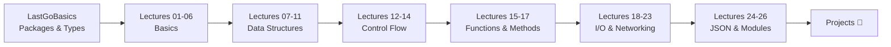

# 🚀 Golang — Learning Go from Scratch

A comprehensive Go learning repository covering **fundamentals to web development**, organized as structured lectures and tour-style basics.

---

## 📂 Repository Structure

```
Golang/
├── LastGoBasics/     # Go Tour fundamentals
├── Lectures/         # 26 structured lectures
├── Projects/         # Hands-on projects
└── README.md         # ← You are here
```

---

## 📘 LastGoBasics — Go Tour Fundamentals

| Module | Topic | README |
|---|---|---|
| Root | Packages, Imports, Exported Names | [📖 README](./LastGoBasics/README.md) |
| `datatypes/` | Go Type System, Integer Ranges, Format Verbs | [📖 README](./LastGoBasics/datatypes/README.md) |
| `functions/` | Multiple Returns, Named Returns, Var Blocks | [📖 README](./LastGoBasics/functions/README.md) |
| `type-conversion/` | Explicit Conversion, Constants, Type Inference | [📖 README](./LastGoBasics/type-conversion/README.md) |

---

## 📗 Lectures — Structured Go Course

### 🟢 Basics (01–06)

| # | Folder | Topic | README |
|---|---|---|---|
| 01 | `01-hello` | Hello World, Packages, `fmt` | [📖 README](./Lectures/01-hello/README.md) |
| 02 | `02-variables` | Variables, Constants, Visibility | [📖 README](./Lectures/02-variables/README.md) |
| 03 | `03-userInput` | User Input, `bufio`, Comma-Error | [📖 README](./Lectures/03-userInput/README.md) |
| 04 | `04-conversion` | Type Conversion, `strconv` | [📖 README](./Lectures/04-conversion/README.md) |
| 05 | `05-time` | Time Handling, Format Layouts | [📖 README](./Lectures/05-time/README.md) |
| 06 | `06-memory-mgt` | Memory Management, GC, Stack vs Heap | [📖 README](./Lectures/06-memory-mgt/README.md) |

### 🔵 Data Structures (07–11)

| # | Folder | Topic | README |
|---|---|---|---|
| 07 | `07-pointers` | Pointers, Address-of, Dereference | [📖 README](./Lectures/07-pointers/README.md) |
| 08 | `08-array` | Arrays, Fixed Size, Value Types | [📖 README](./Lectures/08-array/README.md) |
| 09 | `09-slices` | Slices, `append`, `make`, Sorting | [📖 README](./Lectures/09-slices/README.md) |
| 10 | `10-maps` | Maps, Hash Tables, Comma-OK | [📖 README](./Lectures/10-maps/README.md) |
| 11 | `11-structs` | Structs, Embedding, Format Verbs | [📖 README](./Lectures/11-structs/README.md) |

### 🟡 Control Flow (12–14)

| # | Folder | Topic | README |
|---|---|---|---|
| 12 | `12-ifElse` | If/Else, Init Statements, Error Handling | [📖 README](./Lectures/12-ifElse/README.md) |
| 13 | `13-swtchcase` | Switch/Case, No Fall-Through | [📖 README](./Lectures/13-swtchcase/README.md) |
| 14 | `14-loops` | Loops, `range`, `goto`, `continue` | [📖 README](./Lectures/14-loops/README.md) |

### 🟠 Functions & Methods (15–17)

| # | Folder | Topic | README |
|---|---|---|---|
| 15 | `15-functions` | Functions, Variadic, Multiple Returns | [📖 README](./Lectures/15-functions/README.md) |
| 16 | `16-method` | Methods, Value vs Pointer Receivers | [📖 README](./Lectures/16-method/README.md) |
| 17 | `17-defer` | Defer, LIFO Stack, Panic Recovery | [📖 README](./Lectures/17-defer/README.md) |

### 🔴 I/O & Networking (18–23)

| # | Folder | Topic | README |
|---|---|---|---|
| 18 | `18-files` | File Create, Read, Write | [📖 README](./Lectures/18-files/README.md) |
| 19 | `19-webReq` | HTTP Server & Client, Goroutines | [📖 README](./Lectures/19-webReq/README.md) |
| 20 | `20-URL-handling` | URL Parsing, Query Params | [📖 README](./Lectures/20-URL-handling/README.md) |
| 21 | `21-FndServer` | Express.js Foundation Server | [📖 README](./Lectures/21-FndServer/README.md) |
| 22 | `22-GET-GO` | HTTP GET Requests | [📖 README](./Lectures/22-GET-GO/README.md) |
| 23 | `23-post-json` | HTTP POST (JSON & Form) | [📖 README](./Lectures/23-post-json/README.md) |

### 🟣 JSON & Modules (24–26)

| # | Folder | Topic | README |
|---|---|---|---|
| 24 | `24-bitMoreJSON` | JSON Encoding, Struct Tags, `omitempty` | [📖 README](./Lectures/24-bitMoreJSON/README.md) |
| 25 | `25-consJson` | JSON Decoding, Unmarshalling | [📖 README](./Lectures/25-consJson/README.md) |
| 26 | `26-Mod` | Go Modules, `go.mod`, Semver | [📖 README](./Lectures/26-Mod/README.md) |

---

## 🗺️ Learning Path



---

## 🔗 Essential Resources

- [Go Official Tour](https://go.dev/tour)
- [Effective Go](https://go.dev/doc/effective_go)
- [Go by Example](https://gobyexample.com/)
- [Go Standard Library](https://pkg.go.dev/std)
- [Go Playground](https://go.dev/play/)
